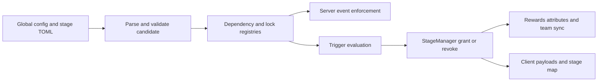

# ProgressiveStages 3.0 Architecture and Project Structure

This guide explains where every kind of file belongs, what each package owns, how a stage travels from TOML into the game, where player progress is stored, how the client receives safe display data, and where an author or contributor should make a change.

Use this guide when the question is “where does this go” or “what happens next.” Use [DOCUMENTATION.md](DOCUMENTATION.md) when the question is “which TOML field do I write.” Use [TESTING.md](TESTING.md) when the question is “how do I prove it works.”

## 1. The shortest possible mental model

ProgressiveStages has six layers.

1. A pack author writes global settings and stage TOML files.
2. The loader parses every candidate stage and rejects the whole candidate snapshot if it is invalid.
3. Runtime registries compile definitions into dependency, lock, tag, trigger, and ability indexes.
4. Server event handlers ask those indexes whether an action should be allowed.
5. `StageManager` changes authoritative ownership and applies the resulting effects.
6. Network payloads send only the client state needed for the map, tooltips, recipe viewers, and visual substitutions.



The server is authoritative. The client can request a map refresh or purchase, but the server decides ownership, requirements, costs, enforcement, rewards, and synchronization.

## 2. Runtime configuration structure

The first server or single-player launch creates this layout inside the Minecraft instance.

```text
config/
└── progressivestages/
    ├── progressivestages.toml
    └── stages/
        ├── mage/
        │   ├── stage.toml
        │   ├── rules.toml
        │   └── progression.toml
        ├── diamond_engineer/
        │   ├── stage.toml
        │   ├── rules.toml
        │   └── progression.toml
        └── 28 more showcase stage packages
```

### `config/progressivestages/progressivestages.toml`

This is the global configuration file. It contains defaults that affect the whole installation:

- General ownership and dependency behavior.
- Global enforcement switches.
- Inventory scan and trigger polling intervals.
- Creative and spectator disclosure behavior.
- EMI and JEI presentation defaults.
- Team and optional integration settings.
- Cache and performance settings.
- Every player-facing message template, sound, volume, and pitch.

The file location is registered through `Constants.MAIN_CONFIG_FILE`. NeoForge writes the file inside the `progressivestages` folder rather than loose at the top level of `config`.

### `config/progressivestages/stages/`

Every `.toml` file under this directory is treated as a stage candidate. Nested folders are supported, so a large pack can organize files without changing stage IDs:

```text
stages/
├── ages/
│   ├── stone_age.toml
│   └── iron_age.toml
├── magic/
│   ├── novice_magic.toml
│   └── master_magic.toml
└── exploration/
    └── nether_explorer.toml
```

The value at `[stage].id` is authoritative. The folder and filename are for humans and do not rename the stage.

`triggers.toml` is deliberately ignored. In 3.0, triggers belong inside the stage they grant as one or more `[[triggers]]` blocks.

### Generated showcase packages

If no stage files exist, `DefaultShowcaseStages` writes fifty schema 4 stage packages and one hundred fifty
files. The dependency graph contains independent class roots, evolutions, mastery stages, hybrid
stages, and an at-least-three finale. It also provides real runtime examples of purchases,
automatic grants, rewards, temporary rules, contextual modifiers, drop modifiers, challenges,
variables, formulas, states, and ability gates. [SHOWCASE_PACK.md](SHOWCASE_PACK.md) documents the
whole tree. Existing installations are never modified by this generator because any discovered
stage causes generation to be skipped.

`DefaultStageTemplates` retains the older one-file examples for compatibility and documentation
tests. [examples/reference/diamond_stage.toml](examples/reference/diamond_stage.toml) remains the
complete commented legacy reference, but it is not generated into new installations.

### Migration behavior

`ConfigPaths.prepareAndMigrate` creates the new hierarchy and recognizes older layouts:

- A loose `config/progressivestages.toml` becomes `config/progressivestages/progressivestages.toml`.
- Loose stage TOMLs in the older `config/ProgressiveStages/` or lower-case folder move into `stages/`.
- An existing 3.0 target is never overwritten.
- If an atomic move cannot be used, the migrator tries a normal move and then a non-destructive copy.

## 3. Datapack structure

A mod or datapack can ship default stages here:

```text
data/
└── examplepack/
    └── progressivestages/
        └── stages/
            ├── stone_age.toml
            └── magic_age.toml
```

The complete path is `data/<namespace>/progressivestages/stages/*.toml`.

`DatapackStageLoader` reads these resources during resource reload. `StageFileLoader` merges them with config-folder stages. If both sources declare the same stage ID, the config-folder stage wins. This lets a pack ship safe defaults while a server owner retains final control.

## 4. Anatomy of one stage file

A stage file is a collection of optional sections around one required identity table. Delete unused sections. Their order does not change behavior.

| Section | Responsibility |
|---|---|
| `[stage]` | ID, name, description, dependencies, scope, duration, tags, category, and visibility metadata. |
| `[display]` | Map position, frame, background, reveal rule, icon masking, tooltips, and encrypted block display. |
| `[items]` through `[brewing]` | Content lock declarations. |
| `[[interactions]]` | Exact item, block, and entity interaction combinations. |
| `[[regions]]` | Hand-authored three dimensional protected boxes. |
| `[[ores.overrides]]` | Server-authoritative block substitutions and guarded drops. |
| `[unlocks]` | Exceptions scoped to this stage's broad locks. |
| `[enforcement]` | Per-stage exemptions and overrides of global enforcement defaults. |
| `[[triggers]]` | One automatic route to grant the stage. Several blocks are alternative routes. |
| `[[temporary_locks]]` and `[[temporary_unlocks]]` | Live context rules that temporarily restrict or permit several target categories. |
| `[[triggered_locks]]` and `[[triggered_unlocks]]` | Combat, event, command, or API timers with priority-based access effects. |
| `[attribute]` | Attribute changes held while the stage is owned. |
| `[revoke]` | Conditions that remove the stage. |
| `[cost]` | Purchase requirements, cooldown, bypass policy, and refund. |
| `[rewards]` | Items, effects, commands, teleport, and XP applied after a real grant. |
| `[unlock]` | Toast, title, sound, particles, nudges, and goal HUD presentation. |

The schema is defined by `StageDefinition` and its smaller value objects, then populated by `StageFileParser`. The complete field-by-field reference is [DOCUMENTATION.md](DOCUMENTATION.md), and the copy-ready example is [diamond_stage.toml](examples/reference/diamond_stage.toml).

## 5. Minecraft structure gating

“Structure” can mean a project folder or a Minecraft generated structure. This section covers the Minecraft feature.

```toml
[structures]
locked_entry = [
    "minecraft:stronghold",
    "minecraft:ancient_city",
]

[structures.rules]
prevent_block_break = true
prevent_block_place = true
prevent_explosions = true
disable_mob_spawning = true
entry_padding = 3
```

The flow is:

1. `StageFileParser` reads the structure IDs and rule flags.
2. `LockRegistry` stores every gating stage for each structure.
3. `StructureEnforcer` resolves the registered structure at a player or event position.
4. The enforcer checks every stage still gating that structure.
5. A player missing any required stage is returned to the last safe position outside the structure. If no safe position exists, the player is moved beyond the structure boundary plus the configured padding.
6. Container interaction and container breaking remain blocked inside a locked structure.
7. Optional flags cancel block breaking, block placement, affected explosion positions, and mob spawning.

When two stages lock the same structure, owning only one is not enough. This is the same all-gating-stages rule used by items, blocks, recipes, and the other lock categories.

The exhaustive field and behavior reference is [section 4.16 of DOCUMENTATION.md](DOCUMENTATION.md#416-structures--entry-rules-chest-locking).

Conditional structure permissions pass through the same exact-bounds lookup. A normal structure
gate enters priority resolution as a lock at zero. `ConditionalLockEngine` evaluates matching live
or timed structure rules, and `StructureEnforcer` applies the highest result. Conditional structure
ids are included in the candidate scan even when no normal stage gate names them.

## 6. Repository structure

The source root is `src/main/java/com/enviouse/progressivestages/`.

```text
Progressivestages.java
├── common/
│   ├── api/
│   ├── compat/
│   ├── config/
│   ├── data/
│   ├── lock/
│   ├── network/
│   ├── stage/
│   ├── tags/
│   ├── team/
│   ├── trigger/
│   └── util/
├── server/
│   ├── commands/
│   ├── enforcement/
│   ├── integration/
│   ├── loader/
│   └── triggers/
├── client/
│   ├── emi/
│   ├── gui/
│   ├── jei/
│   ├── renderer/
│   └── util/
├── compat/
└── mixin/
```

### Entry point

`Progressivestages.java` registers the common config, data attachments, loot modifier codec, event handlers, network payloads, commands, and configuration migration. It is wiring, not the place for category-specific rules.

### `common/api`

- `ProgressiveStagesAPI` is the supported Java facade for ownership, mutations, definitions, dependencies, trigger progress, counters, bulk changes, and synchronization.
- `StageId` normalizes resource identifiers.
- `StageCause` records why a change happened, such as command, trigger, script, quest, purchase, or regression.
- `StageChangeEvent` reports an individual real change.
- `StagesBulkChangedEvent` reports the initial bulk state available during login synchronization.
- `StageChangeType` distinguishes grant and revoke.

Integrations should prefer this package over reaching into `StageManager` internals.

### `common/config`

- `StageConfig` defines every global NeoForge config value and exposes cached getters.
- `ConfigPaths` owns the 3.0 folder hierarchy and legacy migration.
- `StageDefinition` is the immutable parsed model of one stage.
- `StageCost`, `StageRewards`, `UnlockEffects`, `StageAttribute`, and `RevokeRule` hold focused optional behaviors.

### `common/lock`

- `PrefixEntry` parses `id:`, `mod:`, `tag:`, `name:`, and tag shorthand.
- `CategoryLocks` represents the locked and always-unlocked lists for one category.
- `LockDefinition` groups the lock declarations belonging to one stage.
- `LockRegistry` compiles all loaded definitions into fast category indexes that retain every gating stage.
- `EnforcementCategory` names policy surfaces shared by global and per-stage settings.
- `ConditionalRule` is the immutable model for live and timed lock or unlock rules, contexts,
  targets, exceptions, stage state, triggers, durations, and priorities.

This package answers “which stages gate this thing.” It does not decide how an event is cancelled.

### `common/stage`

- `StageManager` owns authoritative grant, revoke, lookup, scope resolution, dependency handling, event emission, team synchronization, and downstream effects.
- `StageOrder` owns the dependency graph, dependency and dependent traversal, and graph validation.
- `DependencyMode` represents all, any, and counted dependency rules.

### `common/data` and `common/team`

- `StageAttachments` registers the saved NeoForge level attachment.
- `TeamStageData` serializes the team or player UUID to stage-set mapping.
- `TeamProvider` resolves a player UUID in solo mode or an FTB Teams UUID in team mode.
- `TeamStageSync` sends stage changes to online members sharing the same ownership scope.

A team-scoped stage uses the resolved team identity. A server-scoped stage uses the shared server identity. Client caches are views, never the source of truth.

### `common/trigger` and `server/triggers`

The model package contains `TriggerRule`, `TriggerCondition`, `TriggerConditionType`, and `TriggerMode`.

The server package contains:

- `StageTriggerEvaluator`, which builds event indexes, evaluates relevant rules, describes progress, and grants satisfied stages.
- `StageCounterData`, which stores engine and named counter values.
- `TriggerPersistence`, which stores one-shot world observations.
- `StagePurchaseData`, which stores purchase cooldown and refundable purchase records.
- `StageRegressionData` and `StageRegressionHandler`, which track grant times, temporary stages, XP rules, death rules, and cascades.

### `server/loader`

- `StageFileLoader` scans config files, merges datapack stages, validates a complete candidate, applies a snapshot, and rolls back a failed reload.
- `StageFileParser` converts TOML into immutable stage models and detailed parse errors.
- `DatapackStageLoader` reads server resource stages.
- `DefaultShowcaseStages` owns the fifty-package first-launch showcase.
- `DefaultStageTemplates` retains the legacy one-file documentation and compatibility references.

### `server/enforcement`

Each class owns one event surface or a tightly related group.

| Class | Main responsibility |
|---|---|
| `ItemEnforcer` | Use and pickup checks plus throttled lock feedback. |
| `InventoryScanner` | Hotbar, inventory, Curios, and enchantment reconciliation. |
| `BlockEnforcer` | Block placement and right-click interaction. |
| `RecipeEnforcer` and `IngredientGateHelper` | Craft result and ingredient rules. |
| `CropEnforcer` | Planting, growth, bonemeal, and harvest. |
| `DimensionEnforcer` | Travel cancellation and post-travel safety checks. |
| `EnchantEnforcer` | Enchantment menus, anvils, trades, stripping, and level caps. |
| `EntityEnforcer` | Attack and entity interaction gates. |
| `FluidEnforcer` | Bucket, placement, flow, and submersion behavior. |
| `InteractionEnforcer` | Fine-grained item-on-target rules. |
| `LootEnforcer` and `StageLootModifier` | Drop and generated loot filtering. |
| `MobSpawnEnforcer` and `MobReplacementEnforcer` | Spawn cancellation and substitution. |
| `PetEnforcer` | Tame, breed, command, and ride rules. |
| `ScreenEnforcer` | Block and held-item menu opening. |
| `TradeEnforcer` and `VillagerProfessionEnforcer` | Offer and profession access. |
| `AdvancementHider` | Resends advancement data after ownership changes. |
| `RegionEnforcer` | Hand-authored box entry and rule flags. |
| `StructureEnforcer` | Generated structure entry, containers, and rule flags. |
| `ConditionalLockEngine` | Context snapshots, event-driven timers, target matching, and deterministic priority resolution. |
| `AbilityEnforcer` | Jump, elytra, sprint, swim, and climb rules. |
| `StageAttributeApplier` | Adds and removes stage-owned attributes. |
| `StageRewardApplier` | Applies grant rewards once per real grant. |
| `UnlockEffectsApplier` | Sends configured unlock presentation. |
| `OreSpoofManager` and related classes | Tracks substitutions, chunk rewriting, break behavior, and guarded drops. |

`ServerEventHandler` is the event-bus router that calls these focused enforcers.

### `server/commands`

`StageCommand` builds `/stage`, `/stages`, `/pstages`, and `/progressivestages`. It owns permissions, arguments, suggestions, authoring actions, progress output, validation output, and GUI requests. It calls the public API or focused services rather than duplicating stage ownership logic.

### `common/network`

`NetworkHandler` registers every payload and the direction in which it may travel.

Server-to-client state includes:

- Full stage ownership and incremental ownership updates.
- Lock maps needed for local rendering.
- Safe stage definition metadata needed by the progression map.
- Trigger and purchase progress for the current player.
- Creative bypass and stage-name disclosure policy.
- Ore and encrypted-block substitutions.
- Unlock toasts and active goal HUD state.

Client-to-server requests include:

- Requesting current GUI data.
- Requesting a stage purchase.

The purchase handler validates the stage, dependencies, trigger policy, cost, cooldown, and ownership on the server before changing anything.

### `client`

- `ClientStageCache` mirrors owned stages.
- `ClientLockCache` mirrors render-relevant lock indexes.
- `ClientTriggerProgress` holds live map progress and purchase presentation.
- `StageTreeScreen` draws the vanilla-style draggable map, nodes, search, hover cards, pinned details, and purchase controls.
- `ClientModBusEvents` registers the keybind and item decorators.
- `ClientEventHandler` owns tooltips, input, HUD, and client lifecycle cleanup.
- `ClientUnlockJuice` displays unlock presentation.
- `OreSpoofClientState` applies server-supplied visual substitutions.
- `LockedItemDecorator` and `LockIconRenderer` draw the lock icon in normal inventories.
- The `emi` and `jei` packages isolate recipe-viewer rendering and refresh behavior.

### `compat`

Compatibility code is split by optional mod or general seam.

- `ModCompatRegistry` and `AutomationCompatNotes` provide central detection and documented automation behavior.
- `ftbquests` adds stage requirements, tasks, rewards, and recheck hooks.
- `kubejs` binds the global `ProgressiveStages` object and `player.stages` bridge.
- `curios`, `lootr`, `mekanism`, `naturescompass`, and `visualworkbench` own narrow adapters.
- `jade` and `wthit` supply in-world lock providers.
- `recipeviewer` contains shared recipe-viewer mod detection helpers.

`OptionalCompatMixinPlugin` decides whether optional mixin groups may apply. This prevents absent EMI, JEI, or FTB Quests classes from becoming accidental hard dependencies.

### `mixin`

Mixins cover vanilla or optional surfaces that do not expose a sufficient NeoForge event. Examples include crafting result slots, anvils, enchanting, brewing, beacon effects, merchants, advancement packets, recipe-viewer widgets, and chunk packet rewriting.

Mixin configuration is split into core, EMI, JEI, and FTB Quests JSON files. Optional groups are guarded by the compatibility mixin plugin.

## 7. Startup and reload flow

### Initial server start

1. The mod entry point registers config, payloads, attachments, commands, and events.
2. `ConfigPaths` creates or migrates the folder hierarchy.
3. `StageFileLoader.initialize` clears old in-memory state. This matters when an integrated client opens another world in the same JVM.
4. Defaults are generated only when no stage files are found.
5. Every config stage is parsed.
6. Datapack stages are merged, with config IDs taking precedence.
7. `StageOrder.validateDefinitions` checks the complete graph.
8. If there are any errors, no candidate stages are activated.
9. If valid, the loader replaces the runtime snapshot and rebuilds lock, conditional rule,
   dependency, tag, trigger, and ability indexes.

### Live reload

1. `/progressivestages reload` parses a new candidate without clearing the working snapshot.
2. Any parse, duplicate ID, dependency, registry, or application error rejects the candidate.
3. A rejected candidate leaves the previous working snapshot active.
4. A successful candidate replaces the snapshot.
5. Online players receive fresh definitions, locks, ownership, progress, bypass state, and visual substitutions.

This transactional shape is why one broken file does not leave half of a pack loaded.

## 8. Ownership change flow

Every command, trigger, KubeJS call, quest reward, purchase, regression, and Java integration should converge on `StageManager` through `ProgressiveStagesAPI`.

For a real grant:

1. Normalize and verify the stage ID.
2. Resolve the stage scope and owning team or server identity.
3. Check dependencies unless the caller intentionally uses a bypass operation.
4. Add the stage only if it is not already owned.
5. Record timing and purchase information where relevant.
6. Apply attributes, rewards, and unlock presentation.
7. Emit the Java change event and KubeJS hooks with the cause.
8. Recheck FTB Quests and affected trigger conditions.
9. Synchronize every online player sharing that stage scope.

For a real revoke, the manager removes ownership, processes configured cascade and refunds, removes transient attributes, emits hooks, re-evaluates affected systems, and synchronizes clients.

No event or reward fires merely because a caller asks to grant an already-owned stage.

## 9. Enforcement flow

Most server-side checks follow the same pattern.

1. A NeoForge event or mixin reaches one focused enforcer.
2. Global configuration decides whether the category is active.
3. Creative and spectator bypass rules are applied.
4. `LockRegistry` returns every stage gating the target.
5. Per-stage carve-outs and enforcement policy are evaluated for their owning stage.
6. `StageManager` checks authoritative ownership.
7. A normal remaining gate enters as a lock at priority zero. `ConditionalLockEngine` adds live or
   active timed rules whose stage state, context, target, and exception match.
8. The highest priority wins. A lock wins an equal-priority lock and unlock conflict.
9. The event is cancelled, result removed, output filtered, player moved, or action allowed.
10. Feedback is throttled to prevent chat and sound spam.

Automation surfaces that do not have a meaningful acting player use documented nearest-player or guarded-output behavior. The mod does not pretend shared world generation can safely become different for every player.

## 10. Trigger flow

At snapshot application, `StageTriggerEvaluator` indexes conditions by relevant event family. A kill event does not scan unrelated sleep, biome, or crafting conditions.

When a relevant event occurs:

1. The event updates a vanilla or mod-owned counter where needed.
2. Only affected conditions are selected.
3. Conditions calculate current value, target value, and satisfaction.
4. `all_of` requires every condition in that rule. `any_of` requires at least one.
5. A stage with several `[[triggers]]` blocks treats those blocks as alternative routes.
6. Dependencies are checked before grant.
7. A satisfied and reachable stage is granted with `StageCause.TRIGGER`.

The poll interval is a safety net for state conditions such as location, held items, weather, and effects. Named custom counters and KubeJS progress providers use the same progress model shown by commands and the GUI.

Conditional triggered locks use a separate event-indexed flow. Damage and death events select only
rules registered for `combat`, `attack`, `hurt`, or `kill`, optionally match the opponent selector,
and start or refresh one player timer. Manual rules start through `/pstages rule`, KubeJS, or the
Java API. Timers are runtime state and clear on logout or server stop. Live temporary rules do not
poll globally. They are evaluated only when an affected enforcement surface asks for a decision,
with player location context cached for one game tick.

## 11. Test structure

Unit tests live under `src/test/java/com/enviouse/progressivestages/` and mirror the source packages.

- API tests cover identifier and mutation contracts that do not require a running client.
- Config tests protect immutable model behavior.
- Stage tests cover dependency modes and graph ordering.
- Trigger tests cover condition naming and purchase persistence.
- Conditional rule tests cover TOML shapes, durations, target exceptions, priority ordering, and
  safe tie behavior.
- Client cache tests cover multi-stage lock state.
- Compatibility tests cover optional mixin gating and script hook reset behavior.
- Loader tests parse stage files, validate the beginner pack, and prove the Diamond Stage reference matches the generated default.
- Release presentation tests verify that the logo, mod metadata, README, and CurseForge description remain connected.

Run a forced verification so Gradle cannot reuse stale test outputs:

```bash
./gradlew clean test --rerun-tasks --no-configuration-cache
./gradlew clean build --no-configuration-cache --warning-mode all
```

The broader client, dedicated server, multiplayer, UI, and optional-mod matrix is in [TESTING.md](TESTING.md).

## 12. Where to make a change

| Goal | First place to inspect |
|---|---|
| Add a global option | `StageConfig`, then the relevant enforcer and documentation. |
| Add a stage TOML field | Schema model or `StageDefinition`, the matching compiler or parser, editor schema, documentation, and focused tests. |
| Add a lock category | Lock model, `LockRegistry`, focused enforcer, network cache if rendered, docs, and tests. |
| Add a trigger condition | `TriggerConditionType`, parser, evaluator index and value logic, progress labels, docs, and tests. |
| Add a command | `StageCommand`, permission and suggestions, docs, and a runtime check. |
| Add a KubeJS method | `PSKubeBindings`, public API if generally useful, docs, and script tests. |
| Add a Java integration API | `ProgressiveStagesAPI` and an event or service seam. |
| Change the stage map | `StageTreeScreen`, definition or GUI payloads, client cache tests, and the UI matrix. |
| Add an optional integration | A focused `compat` package, safe detection, optional mixin gate if needed, and absent-mod build testing. |
| Change saved ownership | `TeamStageData`, codecs, migration compatibility, multiplayer tests, and server restart tests. |
| Change first-launch examples | `DefaultShowcaseStages`, showcase documentation, package compilation tests, and graph validation tests. |

## 13. Release files

The repository root contains the maintained release surfaces:

| File | Audience |
|---|---|
| `README.md` | Fast project overview and changelog. |
| `GETTING_STARTED.md` | First-time pack authors. |
| `DOCUMENTATION.md` | Exhaustive user-facing reference. |
| `TEMPORARY_AND_TRIGGERED_LOCKS.md` | Focused conditional rules tutorial and copy-ready scenarios. |
| `ARCHITECTURE.md` | Maintainers and integration authors. |
| `TESTING.md` | Testers and release approvers. |
| `CURSEFORGE.md` | Copy-ready public project description. |
| `plan.md` | Fifteen-feature product plan and implementation status. |
| `implementation/ProgressiveStages_3.0_Release_Plan.md` | Release gates and implemented 3.0 scope. |

The release logo lives at `src/main/resources/progressivestages.png`. `neoforge.mods.toml` names that root resource with `logoFile`, so it appears in compatible mod-list screens and can be uploaded as the CurseForge project image.

### Generic exact structure compatibility

The public provider and value contracts live under
`common/api/structure`. `StructureContextRegistry` owns provider registration, three-way
arbitration, last-known claims, thread checks, and rate-limited provider failures.
`StructureSessionManager` owns committed participants, visit sequencing, exit debounce,
completion, lifecycle outcomes, reconciliation, and team-safe stage leases. `StructureEnforcer`
combines the normal static gate with provider decisions. This is a one-way extension seam:
companion mods depend on ProgressiveStages and ProgressiveStages never imports the companion API.

See [STRUCTURE_SESSION_COMPATIBILITY.md](STRUCTURE_SESSION_COMPATIBILITY.md) for the complete
contract and acceptance matrix.

The built JAR is created under `build/libs/`. Generated metadata under `build/` is disposable output and should never be treated as the source of truth.

## 14. Non-negotiable boundaries

- Server state is authoritative.
- Config and datapack stages are data, not hard-coded progression.
- A config stage overrides a datapack stage with the same ID.
- A failed reload keeps the last working snapshot.
- Optional integrations must stay optional when their mods are absent.
- Multiple gating stages are preserved until each applicable requirement is owned.
- Per-stage carve-outs and policies stay scoped to the stage that declared them.
- The client receives presentation state, not permission to change ownership.
- Shared world generation is not personalized per player. Visual substitution and guarded drops provide predictable multiplayer behavior.
- Expensive conditions are indexed by relevant events and use polling only as a safety net.

Those boundaries are the quickest way to decide whether a proposed feature fits the architecture or needs a new explicit service seam.
